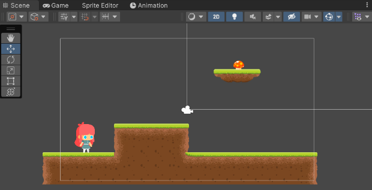
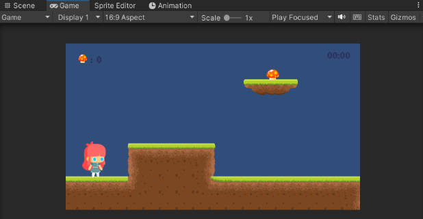
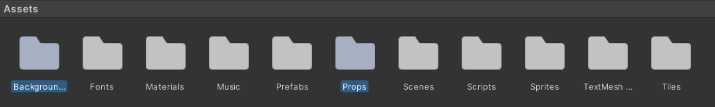

# Mushroom Collecting Platformer
**Note:** For this project Unity Hub 3.4.1, Unity Editor version 2021.3.17f1, and Visual Studio Code 2022. It is recommended that you use the same version

##  Create The Project
The files to help you create a game similar to the one we have created are available on our repository (in our assets folder). To begin you will need to create a new project.
- Open unity hub and select new project
  
- This will open a menu displaying different templates available in unity
- For the game you are making you will need to select 2D core
  
Name the project and when when you are ready click “create project”. Now you are ready to start creating!

##  Lay The Level Out
Unity has provided you with an empty scene. A good place to start is laying out the level. Navigate into the asset folder (found at the bottom of the unity window - in the project Tab). In it you will find a folder called "Tiles" 
  
- In this folder there are multiple png images provided that we used to create a “Tile Palette”
    - A tile palette is a grid of images used to paint the ground of a level
- To create the palette go to the to bar and select: Window > 2D > Tile Palette. This will open a window that looks like this: 
  
- From here you can drag the pngs into the empty palette

*Note: We have aklready provided you with 4 palettes to use. You can select a palette using the following dropdown:*  

  

### Painting
To start painting you will first need to make a tile map object. Right click in the Hierarchy tab and select: 2D Object > Tilemap > Rectangular - name this object “ground”. If you plan to include water, duplicate the ground object and name it water. Anything that you want to be ground should be painted on the “ground” object and similarly the water should be painted on the “water” object.
- Note: if you do not plan on adding water, you so not need the water layer
  

To actually paint click the paintbrush icon in the palette and drag you mouse over the tiles you would like to paint onto the scene:  
  
- Now when you are on the tilemap layers you can paint tiles onto the grid  

Some other palette tools include:
- Select  

- Move  

- Erase  
   

##  Tags and Layer Labels
Now that you have a level, you will need to set some attributes before it can be properly interacted with. First:
- Select the ground tilemap object
- Select the Inspector tab (on the right of your page)
- Create a new tag called “Ground” (using the dropdown menu)
- Create a new layer also called “Ground” (using another dropdown menu)
  

 Now, if you also have a water tilemap object:
- Select the Inspector tab
- You can leave this object untagged
- Set layer to "Water"  
  

Finally, you will also need to set the water tilemap collider's trigger to true:
- This can also be found in the Inspector tab
- This setting makes it so that the player script can recognize the player has fallen in water.  

##  Mechanics & Physics
Before we add a player to the scene, colliders must be added to the tilemap. Colliders are added so object can collide/interact with each other. To add a collider: 
- Select a tilemap and open the Inspector tab
- Click “Add Component” > Tilemap > Tilemap Collider 2D
- Also add:  “Add Component” > Physics 2D > Rigidbody 2D
    - Set body type to static (we don't want the ground to move)

##   Adding the Objectives
 
Your level exists! Now you have to add items to collect around the scene. Right click in the hierarchy tab and select “Create Empty”. Rename this to items or mushrooms; This is where you will put any mushrooms you add to the scene.
 
Now drag in as many mushrooms as you would like into the level!  

##   Adding a Player
 
Now you have enough set up to add a player to the scene. You can use one of the player prefabs available in the Assets > Prefab folder as the main character of your game. To have a properly functioning player object you will also have to add the ScoreUI prefab to the scene. When this object is dragged in it will appear very large, but it is properly visible in the “game” window. 
  

If you view the player in the inspector tab you will see that there is a “PlayerScore” script. This is the code that will count the amount of mushrooms you collect in the game.  
  
Expand the ScoreUI object and you will see an object called “Score”.
- With your player open in the Inspector tab, drag “Score” into the Score Text field 

You will also need to drag the mushroom parent object into "The Shrooms" field in the player score script. The parent object is the object you put all the mushrooms in earlier.  

 The final player score should appear as follows:
  

##  Sprite Sheets
*This section is not needed - it provides background on how to make a sprite if you would like to experiment*  
Our provided sprites do not use traditional sprite sheets. To start creating a player from "scratch" (not using a prefab), you first select the character you want to use (Sally or Luna).
- Open the idle folder (it will be your base animation)
- Select all of the sprites and drag them into the scene. This will create an animation and controller!
- When you make more animations. You can drag the .anim file onto the player (in the hierarchy window)

##  Camera Follow
If you made your level bigger than the camera size, the camera will have to follow your player. In the Assets > Scripts folder there is a file called “CameraFollow”.
- Select the MainCamera and drag the Camera Follow script into the inspector tab
    - The camera will need a target to follow  
  
- In our case this will be the player, so drag your player into the Target field  

 *Note: this will not be necessary if your level is the size of the camera view*

##  Spruce Things Up
  
You can add a background and props to the scene if you see fit.
- The backgrounds are in the Assets > Backgrounds folder 
- The props are in the Assets > Props folder 
    - You may have to change the objects renderer > additional settings > order in layer, for things to appear as you intended
    - You can put the background on layer 0 and everything else on 1
      
      
- Feel free to tweak the code and see how it affects the game

*Bonus: Moving Platforms*
- We have provided some assets to create moving platforms
- In the Assets > Prefabs folder there is a platform object that can be used to create a moving platform 
    - You will need to create 2 empty object to use as the start and end points of the platform

 Happy Platforming!!
 -JJ Developers

